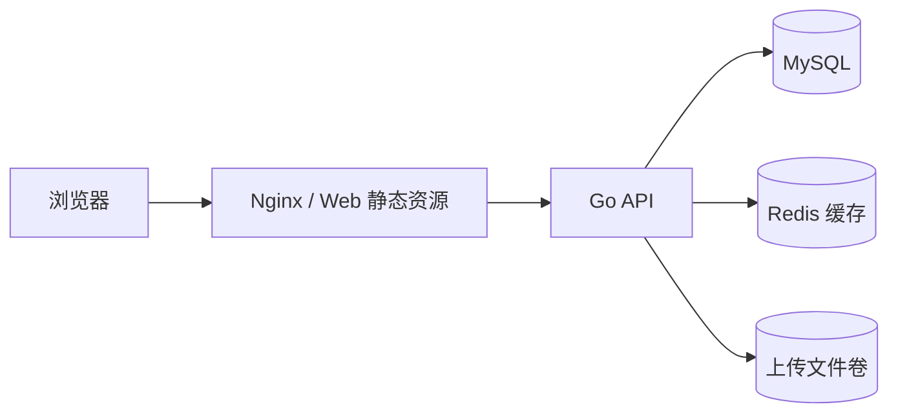

# 系统架构

## 架构目标

Solitude Blog 以可维护、可恢复和适合个人长期写作为主要目标：

- 公开阅读与后台管理共享数据模型，但保持不同的交互密度。
- MySQL 作为唯一业务事实来源，缓存故障不得改变数据语义。
- 服务数量与真实需求匹配，不保留无调用的占位进程。
- 数据结构、专题标识和公开 URL 具有明确兼容策略。
- 本机开发、容器部署和生产安全边界在文档中明确区分。

## 运行架构



| 组件 | 当前职责 |
| --- | --- |
| Vue Web | 公开站点、管理后台、路由、主题、表单和 API 调用 |
| Nginx | 静态资源、SPA fallback、API 反向代理和基础安全头 |
| Go API | 认证、内容管理、媒体、站点配置、搜索、RSS 与 sitemap |
| MySQL | 用户、文章、专题、标签、媒体元数据、公告与站点设置 |
| Redis | 公开文章列表/详情和站点配置等可重建缓存 |
| 本地存储卷 | 上传文件原件 |

当前没有异步任务服务。图片转换、批量索引或统计任务只有在同步链路出现可量化问题后才评估；引入时必须同时设计生产者、消费者、幂等、重试、监控和失败恢复。

## 请求边界

### Web

- 公开页面：主页、文章详情、归档、搜索、关于。
- 后台页面：登录、仪表盘、文章、专题、标签、媒体、公告和站点设置。
- API 数据通过 `web/src/api/` 访问；页面不直接拼接服务端地址。
- 主题和明暗模式使用独立状态轴，组件只读取语义 token。

### API

- Handler 负责 HTTP 参数、鉴权上下文和响应转换。
- Service 负责业务校验、数据库编排和缓存失效。
- Model 定义持久化结构与跨层稳定领域常量。
- Database 负责连接、AutoMigrate、当前版本兼容升级与初始化数据。
- 静态上传目录只由媒体服务生成存储键，不接受业务调用方提供任意磁盘路径。

## 数据与专题

一篇文章必须关联一个专题。固定专题契约如下：

| Name | Label | Slug |
| --- | --- | --- |
| 雾里拾笺 | `NODES` | `nodes` |
| 微光造物 | `CODE` | `code` |
| 风过留痕 | `JOTTING` | `jotting` |

`label`、`slug` 是稳定标识，展示名称可以在不破坏链接和筛选契约的前提下调整。已有数据库升级仍保留两类兼容：

- 完整的早期默认专题 `Notes / Notes / notes` 转换为 `NODES/nodes`。
- 中间版本 `categories/category_id` 映射为 `topics/topic_id`。

兼容逻辑必须保持幂等；确认所有持久化环境完成升级并建立显式迁移基线前不得删除。

## 认证现状

- 管理接口使用 JWT Bearer Token 鉴权。
- API 提供登录、刷新和登出接口。
- 当前 Refresh Token 尚未形成完整的服务端持久化、轮换与撤销链路，登出不应被文档描述为可终止所有刷新会话。
- 生产环境必须使用不同的高熵 Access/Refresh 密钥和强管理员密码。

服务端会校验启动所需配置，并在生产环境拒绝常见占位密钥。认证会话加固见 [实施路线图](../../02-requirements/roadmap/01-implementation-roadmap.md)。

## 缓存原则

- MySQL 始终是事实来源。
- 公开文章列表、文章详情和站点配置可读 Redis 缓存。
- 内容或配置写入成功后失效相关缓存。
- 缓存不可用时允许回源 MySQL；数据库不可用时返回明确错误，不返回示例数据。
- 缓存键带版本前缀，结构变化时升级版本或显式清理。

## 媒体存储

当前使用本地持久化卷：

```text
storage/uploads/
```

数据库保存展示名、存储键、URL、MIME、大小和 hash 等元数据。上传卷必须与数据库形成可对应的备份恢复点；仅备份 MySQL 不能恢复完整博客。

未来切换对象存储时保持 `storage_key` 语义稳定，通过存储层迁移，不把环境相关绝对路径写入文章正文。

## 部署边界

Compose 仅打包 `api` 与 `nginx` 两个服务；**MySQL 与 Redis 由外部托管服务提供**，不在本仓库 Compose 内启动：

- 只有 Nginx 面向外部监听。
- API 调试端口（若有）绑定 `127.0.0.1`；外部 MySQL / Redis 不暴露宿主机端口。
- `.env` 通过原子变量注入外部实例地址与端口，Go 配置层据此组合 DSN / Addr。
- Nginx 配置只处理 HTTP；HTTPS 由真实边缘代理或平台终止。
- 外部数据库 / 缓存的备份责任由托管方承担；本仓库仅保留 `api-storage` 上传卷，仍需独立备份。
- 常驻服务使用 `restart: unless-stopped`，但仍需外部监控。

部署和恢复步骤见 [部署与备份运行手册](../../04-operations/runbook/01-deployment-and-backup.md)。

## 主要欠账

- Refresh Token 服务端撤销和轮换。
- 媒体引用安全与完整上传校验。
- 数据库与上传文件一致性备份。
- 显式数据库迁移版本。
- 前端自动化、浏览器视觉与读屏基线。

以上能力在完成源码和环境验收前均保持待办状态。
