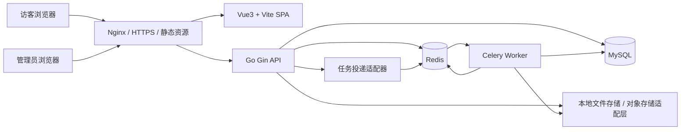

# 新系统架构设计

## 架构目标

新版个人博客系统的目标不是简单“换皮”，而是把旧项目升级为一个可长期维护、可渐进扩展、体验更现代的内容管理系统。

核心目标：

- 前台阅读体验清爽、响应式、适合技术文章阅读。
- 后台管理高效，围绕写作、发布、资源管理、站点配置展开。
- 后端具备清晰分层、统一鉴权、缓存、异步任务和可观测性。
- 数据模型从字符串拼接升级为关系化建模。
- 支持从旧项目迁移文章、图片、旧分类、标签和站点配置，其中旧分类统一转换为专题。

非目标：

- 第一阶段不做多作者社区。
- 第一阶段不做复杂评论系统，可预留接口与表结构。
- 第一阶段不引入大型前端 UI 组件库。
- 第一阶段不强依赖 Kubernetes，先以 Docker Compose + Nginx 部署为主。

## 总体架构



## 技术栈定位

### 前端

- Vue 3：核心视图框架。
- Vite：开发与构建工具。
- TypeScript：接口、模型、组件 props、store 全量类型化。
- `<script setup>`：所有新组件统一采用 setup 语法糖。
- Vue Router：公开站点与后台管理路由。
- Pinia：推荐作为状态管理，不属于 UI 组件库，适合替代旧 Vuex。
- Sass：设计变量、mixins、响应式断点、组件样式。
- Axios 或 Fetch 封装：统一请求、错误处理、JWT 刷新。
- Markdown 渲染：可使用 Markdown 解析/高亮库，但页面 UI 不使用组件库。
- Mist UI：提供雾境海盐、雾境青森的精确色调、语义 token、氛围系统与组件交互规范。项目按业务需求把单主题交付规则适配为二维运行时架构，通过 Sass 同时提供 `mist-sea-salt/mist-forest × light/dark`，但不直接引入第三方 UI 组件库。

### 后端

- Go + Gin：HTTP 服务和路由。
- GORM：ORM 与模型关系管理。
- MySQL：主数据库。
- Redis：缓存、限流、JWT 黑名单、热点计数、Celery broker/result backend。
- JWT：后台访问令牌与刷新令牌。
- Celery：独立异步任务服务。
- Viper：配置管理，可选。
- Zap / Zerolog：结构化日志，可选。
- Goose / Atlas / GORM AutoMigrate：推荐使用显式 migration，避免生产环境仅依赖 AutoMigrate。

### Celery 的边界说明

Celery 是 Python 生态任务队列。为了与 Go 服务稳定协作，建议将它作为独立 worker 服务，而不是把任务逻辑塞进 Go API。

推荐两种投递方式：

- 方式一：Go API 通过任务适配器向 Redis broker 投递 Celery 兼容消息。
- 方式二：增加轻量 `task-gateway` HTTP 服务，由 Go 调用 gateway，gateway 再调用 Celery。

第一阶段可以选择方式二，协议更清晰，排障成本低；后续再根据复杂度决定是否由 Go 直接投递 Celery 消息。

## 服务边界

### Web App

同一个 Vite 应用内分为两个路由组：

- `public`
  - 首页、文章详情、归档、专题、标签、搜索、关于。
- `admin`
  - 登录、仪表盘、文章管理、编辑器、媒体库、专题与标签、公告、站点配置、系统任务。

公开站点和管理台共用：

- API client。
- 类型定义。
- 自研基础组件。
- 参考 Mist UI 的 Sass 设计变量、雾面氛围与语义 token。

二者独立：

- Layout。
- 路由守卫。
- Store。
- 权限菜单。
- 错误页与空状态。

主题状态采用两个独立来源：

- `theme` 是站点级全局配置，只允许 `mist-sea-salt`、`mist-forest`，由管理员在后台修改并持久化到服务端。
- `mode` 只允许 `light`、`dark`。服务端配置只提供访客默认模式；公开前台允许访客切换，并用浏览器 `blog:mode` 保存个人偏好。
- `GET setting/lobby` 同时返回 `theme` 与默认 `mode`。客户端先应用合法的本地 mode；没有本地偏好时才采用服务端默认 mode。
- 修改站点主题或默认模式后，Go service 必须使站点配置缓存失效；当前客户端应用响应中的新配置，其他访客在下次读取 lobby 时生效。
- 主题变化不得清除或改写访客 mode，前台也不得暴露主题色选择器。

### Go API

Go API 只承担同步请求链路：

- 认证与权限。
- 内容读写。
- 媒体上传与元数据维护。
- 站点配置。
- 查询、分页、搜索入口。
- 缓存读写。
- 异步任务投递。

不在同步链路中直接做耗时操作：

- 大图压缩。
- 批量导入。
- 全文索引重建。
- 站点地图生成。
- RSS 生成。
- 统计聚合。
- 数据备份。

### Celery Worker

Celery 负责耗时或可延迟任务：

- 生成图片缩略图与 WebP 版本。
- 从 Markdown 中提取摘要、目录、首图。
- 重建文章搜索索引。
- 生成 sitemap.xml 与 rss.xml。
- 聚合阅读量与访问统计。
- 清理未引用临时图片。
- 导出备份包。
- 执行旧系统迁移任务。

## 后端分层设计

建议目录：

```text
server/
  cmd/
    api/
      main.go
  internal/
    bootstrap/
      app.go
      config.go
      database.go
      redis.go
      logger.go
    router/
      router.go
      public.go
      admin.go
    middleware/
      auth.go
      cors.go
      recovery.go
      ratelimit.go
      request_id.go
    handler/
      article_handler.go
      auth_handler.go
      taxonomy_handler.go
      media_handler.go
      site_handler.go
      dashboard_handler.go
    service/
      article_service.go
      auth_service.go
      media_service.go
      site_service.go
      task_service.go
    repository/
      article_repository.go
      user_repository.go
      media_repository.go
      site_repository.go
    model/
      article.go
      user.go
      topic.go
      tag.go
      asset.go
      site_setting.go
    dto/
      request/
      response/
    cache/
      keys.go
      article_cache.go
    task/
      client.go
      payload.go
    storage/
      local.go
      object.go
    pkg/
      jwt/
      password/
      validator/
      pagination/
      errors/
  migrations/
  configs/
  tests/
```

分层职责：

- `handler`：解析请求、参数校验、调用 service、返回响应。
- `service`：业务编排、事务边界、权限判断、缓存失效、任务投递。
- `repository`：数据库查询，不处理 HTTP 语义。
- `model`：GORM 模型。
- `dto`：请求与响应结构。
- `cache`：缓存键、TTL、失效策略。
- `task`：异步任务接口与 payload。
- `storage`：文件存储抽象。

## 前端分层设计

建议目录：

```text
web/
  src/
    app/
      main.ts
      App.vue
      providers.ts
    router/
      index.ts
      public.routes.ts
      admin.routes.ts
      guards.ts
    layouts/
      public/
      admin/
    pages/
      public/
        home/
        article-detail/
        archives/
        taxonomy/
        about/
        search/
      admin/
        login/
        dashboard/
        articles/
        editor/
        media/
        taxonomy/
        notices/
        settings/
        tasks/
    components/
      base/
        BaseButton.vue
        BaseInput.vue
        BaseModal.vue
        BaseTable.vue
        BasePagination.vue
        BaseToast.vue
      blog/
        ArticleCard.vue
        ArticleMeta.vue
        MarkdownViewer.vue
        TocPanel.vue
      admin/
        EditorToolbar.vue
        UploadPanel.vue
        StatCard.vue
    api/
      http.ts
      modules/
        auth.ts
        articles.ts
        media.ts
        site.ts
    stores/
      auth.ts
      site.ts
      editor.ts
    styles/
      index.scss
      tokens.scss
      mixins.scss
      reset.scss
      utilities.scss
    types/
      article.ts
      auth.ts
      media.ts
      site.ts
    utils/
```

设计要求：

- 所有页面组件使用 `<script setup lang="ts">`。
- 所有接口响应有 TypeScript 类型。
- 所有基础 UI 控件由项目内部实现。
- Sass 变量集中管理颜色、字号、间距、层级、断点，并对齐 Mist UI 的 `--bg-*`、`--text-*`、`--accent*`、`--border*`、`--shadow-*`、`--surface-*`、`--fog-*`、`--radius-*`、`--space-*` 等语义 token。
- 自研组件实现时参考 Mist UI 的 Vue3 组件规则：`modelValue` / `update:modelValue`、props、emits、slots、composables 与完整交互状态。
- 后台表格、弹窗、抽屉、分页、上传、Toast 均自研。

## 鉴权架构

### 登录流程

1. 管理员提交账号密码。
2. API 校验密码哈希。
3. API 返回 `accessToken` 和 `refreshToken`。
4. 前端将 access token 放在内存或短期存储中，refresh token 建议使用 HttpOnly Cookie。
5. access token 过期后调用刷新接口。
6. 登出时 refresh token 加入 Redis 黑名单或删除服务端 token 记录。

### 权限模型

第一阶段只需要单管理员，但模型预留角色：

- `owner`：全部权限。
- `editor`：文章、媒体、专题与标签。
- `viewer`：只读后台。

权限点示例：

- `article:read`
- `article:write`
- `article:publish`
- `media:write`
- `site:write`
- `system:read`

## 缓存架构

Redis 缓存适合存放：

- 站点配置。
- 首页文章列表。
- 文章详情。
- 专题与标签列表。
- 归档统计。
- 热门文章。
- 阅读量增量计数。
- 登录黑名单。
- 限流计数。

缓存原则：

- 公开读接口优先读缓存。
- 管理写接口成功后主动失效相关缓存。
- 阅读量不每次直接写 MySQL，先累加到 Redis，再由 Celery 定时落库。
- 缓存键带版本前缀，便于整体失效。

示例：

```text
blog:v1:site:settings
blog:v1:article:detail:{slug}
blog:v1:article:list:{cursor}:{limit}:{filter_hash}
blog:v1:taxonomy:topics
blog:v1:taxonomy:tags
blog:v1:views:article:{article_id}
blog:v1:jwt:blacklist:{jti}
```

## 文件与媒体存储

第一阶段使用本地目录：

```text
storage/
  uploads/
    original/
    thumbnail/
    webp/
```

数据库只存元数据：

- 原始文件名。
- 存储 key。
- MIME type。
- 文件大小。
- 宽高。
- hash。
- 访问 URL。
- 引用数量。

后续可以将 `storage` 接口切换为 MinIO、S3 或 CDN 源站。

## 部署架构

开发环境推荐 Docker Compose：

```text
nginx
web
api
worker
mysql
redis
```

生产环境推荐：

- Nginx 负责 HTTPS、静态资源、反向代理。
- Web 构建产物由 Nginx 托管。
- Go API 作为常驻服务。
- Celery Worker 独立常驻。
- MySQL 开启定期备份。
- Redis 开启持久化或至少保留任务与计数所需的可靠配置。
- 文件存储目录挂载持久化卷。

## 请求链路示例

### 文章详情

1. 浏览器请求 `/articles/my-post`。
2. Vue Router 进入详情页。
3. 前端携带 `X-API-Version: v1` 请求 `GET article/detail/my-post`。
4. API 查询 Redis 文章详情缓存。
5. 命中则返回。
6. 未命中则查 MySQL，写入缓存后返回。
7. API 将阅读量增量写入 Redis。
8. Celery 定时把阅读量增量聚合写回 MySQL。

### 发布文章

1. 管理员在后台编辑 Markdown。
2. 前端携带 `X-API-Version: v1` 提交 `POST article/create` 或 `PUT article/update/{id}`。
3. API 校验 JWT 与权限。
4. Service 开启事务，写文章的 `topic_id`、标签关系和版本记录。
5. 事务成功后失效文章列表、归档、专题与标签缓存。
6. API 投递 Celery 任务：提取摘要、生成目录、重建索引、生成 sitemap/rss。
7. 前端显示发布成功。
