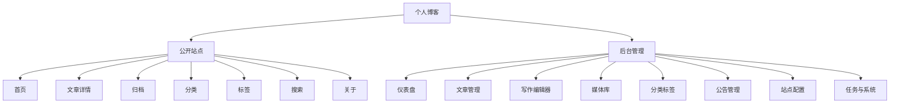

# 产品与交互设计

## 产品定位

新版博客应从“简单文章展示”升级为“个人知识主页”。它既要适合访客阅读，也要让作者自己愿意长期写作、整理和维护。

关键词：

- 安静。
- 清晰。
- 快速。
- 适合长文。
- 后台高效。
- 可持续维护。

## 信息架构

## 公开站点页面设计

### 首页

首页是第一屏核心，应展示：

- 站点名称与一句简短签名。
- 最新文章列表。
- 文章摘要、分类、标签、发布时间、阅读量。
- 作者信息卡。
- 公告或近期状态。
- 热门文章或精选文章。
- 标签云。

交互要求：

- 文章列表使用服务端游标分页。
- 支持按分类、标签、关键词过滤。
- 移动端优先展示文章列表，侧边信息折叠到列表之后。
- 骨架屏替代全局遮罩 loading。

### 文章详情

文章详情是阅读体验核心，应包含：

- 文章标题。
- 发布时间、更新时间、分类、标签、阅读量。
- Markdown 正文。
- 代码高亮。
- 目录导航。
- 上一篇 / 下一篇。
- 回到顶部。

交互要求：

- 桌面端目录固定在右侧。
- 移动端目录收起为浮层按钮。
- 代码块提供复制按钮。
- 图片支持点击预览。
- 文章正文宽度保持舒适阅读范围，避免过宽。

### 归档

归档页按年份和月份组织文章：

- 年份分组。
- 月份分组。
- 每篇文章显示标题、日期、分类。
- 支持只看某年。

### 分类与标签

分类和标签不只是列表，应提供：

- 分类/标签总览。
- 每个分类/标签下文章数量。
- 点击后进入文章列表。
- 当前筛选条件可清晰撤销。

### 搜索

第一阶段可做标题、摘要、标签搜索；后续由 Celery 重建索引支持全文搜索。

搜索页包含：

- 搜索框。
- 最近搜索。
- 搜索结果高亮。
- 空状态。
- 加载状态。

### 关于

关于页从站点配置读取 Markdown 内容，适合放：

- 个人介绍。
- 技术栈。
- 项目链接。
- 联系方式。
- 赞赏或订阅信息。

## 后台管理页面设计

### 登录

从旧版“上传密钥文件登录”改为账号密码登录。

页面包含：

- 账号。
- 密码。
- 记住登录状态。
- 登录错误提示。
- 首次初始化管理员入口，可只在无用户时展示。

### 仪表盘

仪表盘用于快速掌握站点状态：

- 文章数量。
- 已发布数量。
- 草稿数量。
- 分类数量。
- 标签数量。
- 图片数量。
- 近 7 日阅读量。
- 最近编辑文章。
- 最近任务状态。
- 服务健康状态。

### 文章管理

文章管理应支持：

- 按标题搜索。
- 按状态筛选：草稿、已发布、私有、归档。
- 按分类筛选。
- 按标签筛选。
- 按发布时间排序。
- 批量操作：发布、下线、删除、移动分类。

表格字段：

- 标题。
- 状态。
- 分类。
- 标签。
- 阅读量。
- 创建时间。
- 更新时间。
- 操作。

### 写作编辑器

编辑器是后台最重要的页面，建议采用三栏或两栏布局：

- 左侧：文章属性。
- 中间：Markdown 编辑区。
- 右侧：实时预览或目录。

文章属性：

- 标题。
- Slug。
- 摘要。
- 封面图。
- 分类。
- 标签。
- 状态。
- 是否置顶。
- 是否精选。
- SEO 标题。
- SEO 描述。

编辑器能力：

- 自动保存草稿。
- 手动保存。
- 预览。
- 发布。
- 插入图片。
- 代码块快捷插入。
- 版本记录。

### 媒体库

媒体库替代旧图床页面：

- 图片上传。
- 网格列表。
- 文件名搜索。
- MIME 和大小过滤。
- 复制 Markdown 图片链接。
- 复制 URL。
- 重命名。
- 删除。
- 查看引用文章。
- 缩略图与原图分离。

### 分类标签

分类与标签独立管理：

- 分类支持名称、slug、描述、排序。
- 标签支持名称、slug、描述、颜色。
- 展示引用文章数量。
- 删除前检查引用关系。

### 公告管理

旧项目已有 `BlogNotice` 表，新版应正式加入后台：

- 公告标题。
- 公告内容。
- 是否启用。
- 排序。
- 生效时间。
- 失效时间。

前台可以展示当前启用的第一条公告，也可以轮播多条公告。

### 站点配置

配置分组：

- 基础信息：站点名、作者、签名、备案号。
- 社交链接：GitHub/Gitee、Bilibili、抖音、邮箱。
- 关于页面：Markdown 内容。
- SEO：默认标题、默认描述、关键词。
- 外观：主题色、头像、站点图标。
- 统计：是否启用访问统计。

## 自研 UI 设计系统

新版不使用 UI 组件库，因此需要在项目内沉淀基础组件。自研组件的 UI 风格参考 `C:\Users\XiaoMeng\.cc-switch\skills\creamy-ui\SKILL.md` 中的 CreamyUI 设计系统：以温暖、柔和、圆润、轻量层级为主，但不把“奶油风”理解为整站米色化或低对比度。

### CreamyUI 风格约束

- 主题结构参考 CreamyUI 的二维主题：`data-theme="strawberry|forest"` 与 `data-mode="light|dark"`。
- 第一阶段推荐默认 `forest + light`，更适合技术博客的阅读与后台管理；保留切换到 `strawberry` 和 `dark` 的 token 结构。
- 组件优先消费语义 token，不直接写死草莓色、森林色或具体色值。
- 视觉语言遵循圆润优先、柔和层级、hover 轻微上浮、active 压下反馈。
- 状态覆盖 default、hover、focus、active、disabled、loading、empty、error。
- 图标使用 SVG/Icon 组件，不依赖 emoji 作为真实图标系统。
- 后台管理台保持信息密度，CreamyUI 只作为组件质感参考，不做大面积装饰化背景。

### Design Tokens

建议定义并映射到 CreamyUI 语义层：

- 背景：`--bg-primary`、`--bg-secondary`、`--bg-card`、`--bg-elevated`、`--bg-inset`、`--bg-hover`。
- 文字：`--text-primary`、`--text-secondary`、`--text-muted`、`--text-on-accent`、`--text-link`。
- 强调色：`--accent`、`--accent-hover`、`--accent-active`、`--accent-soft`。
- 状态色：`--success`、`--warning`、`--danger`、`--info` 与对应 soft token。
- 边框与焦点：`--border`、`--border-strong`、`--border-color`、`--border-focus`、`--focus-ring`。
- 阴影：`--shadow-xs`、`--shadow-sm`、`--shadow-md`、`--shadow-lg`、`--shadow-inset`、`--shadow-glow`。
- 圆角：使用 `--radius-*`，公开站点可更柔和，后台表格与密集控件保持克制。
- 间距：使用 `--space-*`，保留 4、8、12、16、24、32、48 等常用阶梯。
- 字号：正文、小字、标题、页面标题。
- 层级：Header、Drawer、Modal、Toast。
- 断点：mobile、tablet、desktop、wide。

### 基础组件

优先实现：

- `BaseButton`
- `BaseIconButton`
- `BaseInput`
- `BaseTextarea`
- `BaseSelect`
- `BaseCheckbox`
- `BaseSwitch`
- `BaseTag`
- `BaseModal`
- `BaseDrawer`
- `BaseTable`
- `BasePagination`
- `BaseTabs`
- `BaseToast`
- `BaseUpload`
- `BaseSkeleton`
- `BaseEmpty`

这些组件只服务本项目，不追求通用组件库复杂度。

命名与样式约定：

- Vue 文件可继续使用 `BaseButton`、`BaseInput` 等项目内命名。
- CSS 类建议参考 CreamyUI 使用 `cui-*` BEM 风格，例如 `cui-button cui-button--primary is-loading`。
- 表单组件使用 `modelValue` / `update:modelValue`，复杂交互抽成 composable。
- 弹窗、Toast、Upload、Select 等浮层类组件必须处理键盘行为、焦点回收、滚动锁定和 aria 语义。

## 视觉方向

公开站点：

- 使用大面积留白。
- 文章卡片信息密度适中。
- 颜色参考 CreamyUI 的 `forest` 或 `strawberry` 语义 token，保持温暖但克制，强调文字可读性。
- 避免过度装饰和花哨背景。
- 保持技术博客的清晰、沉稳和个人气质。

后台管理：

- 信息密度更高。
- 操作路径短。
- 表格、筛选、编辑器优先。
- 少用装饰性大卡片。
- CreamyUI 的圆角、阴影和状态反馈用于提升质感，但不牺牲可扫描性。
- 每个危险操作必须二次确认。

## 响应式规则

- 小屏：单列布局，导航折叠，目录浮层化。
- 中屏：文章列表单列，侧边栏下沉。
- 大屏：文章列表 + 侧边栏，文章详情 + 目录。
- 后台小屏只保证可用，不强求复杂表格完整体验；关键编辑流程可以转为抽屉或分段表单。

## 可访问性要求

- 所有交互控件支持键盘访问。
- 表单项有 label。
- 错误信息和输入框绑定。
- 色彩对比度满足阅读需求。
- 图标按钮必须有 `aria-label` 或 tooltip。
- 文章正文图片必须支持 alt 文本。

## 性能要求

- 首页首屏接口尽量合并：文章列表、站点配置、分类标签、公告可以并行或聚合。
- 文章详情缓存 HTML/Markdown 渲染必要数据。
- 图片使用缩略图和懒加载。
- 管理台按路由懒加载。
- 代码高亮库按需加载。
- 搜索接口防抖。

## SEO 与开放能力

应提供：

- 语义化 title 和 meta description。
- Open Graph 信息。
- sitemap.xml。
- rss.xml。
- robots.txt。
- 文章 canonical URL。
- slug 稳定化，避免使用纯 hash ID 作为公开链接。
