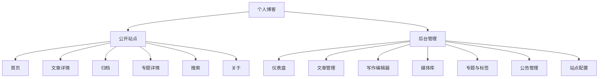

# 产品与交互设计

本文描述目标产品体验，不等同于当前功能清单。页面是否已实现、是否通过验收以 [设计进度追踪](./05-design-progress.md) 为准；精确主题色值见 [雾境主题色调系统](./11-theme-color-system.md)，UI 与布局的已知源码偏差分别记录在 [UI 设计系统](./09-ui-design-system.md#实现偏差清单) 和 [布局模式](./10-layout-patterns.md#16-当前实现偏差清单)。

## 产品定位

新版博客应从“简单文章展示”升级为“个人知识主页”。它既要适合访客阅读，也要让作者自己愿意长期写作、整理和维护。

关键词：

- 安静。
- 清晰。
- 快速。
- 适合长文。
- 后台高效。
- 可持续维护。

## 信息架构

## 公开站点页面设计

### 首页

首页是第一屏核心，应展示：

- 站点名称与一句简短签名。
- 最新文章列表。
- 文章摘要、专题、标签、发布时间、阅读量。
- 作者信息卡。
- 公告或近期状态。
- 热门文章或精选文章。
- 标签云。

交互要求：

- 文章列表使用服务端游标分页。
- 支持按专题、标签、关键词过滤。
- 移动端只在文章列表前保留紧凑的站点身份摘要，完整作者卡与其他侧边信息下沉到列表之后。
- 骨架屏替代全局遮罩 loading。

### 文章详情

文章详情是阅读体验核心，应包含：

- 文章标题。
- 发布时间、更新时间、专题、标签、阅读量。
- Markdown 正文。
- 代码高亮。
- 目录导航。
- 上一篇 / 下一篇。
- 回到顶部。

交互要求：

- 桌面端目录固定在右侧。
- 移动端目录收起为浮层按钮。
- 代码块提供复制按钮。
- 图片支持点击预览。
- 文章正文宽度保持舒适阅读范围，避免过宽。

### 归档

归档页按年份和月份组织文章：

- 年份分组。
- 月份分组。
- 每篇文章显示标题、日期、专题。
- 支持只看某年。

### 专题与标签

专题和标签用于组织与筛选内容：

- 专题/标签总览。
- 每个专题/标签下文章数量。
- 专题进入独立详情与文章列表；标签当前进入搜索筛选结果。
- 当前筛选条件可清晰撤销。

### 搜索

当前搜索覆盖标题、摘要、专题名称/Label 与标签。独立全文索引不在当前基线，只有数据量和查询质量证明需要时才评估。

搜索页包含：

- 搜索框。
- 最近搜索。
- 搜索结果高亮。
- 空状态。
- 加载状态。

### 关于

关于页读取站点名称、作者、签名与经过协议过滤的社交链接；发布原则等编辑式内容当前随页面源码维护。适合展示：

- 个人介绍。
- 技术栈。
- 项目链接。
- 联系方式。
- 赞赏或订阅信息。

## 后台管理页面设计

### 登录

后台使用账号密码登录。

页面包含：

- 账号。
- 密码。
- 记住登录状态。
- 登录错误提示。
- 首次初始化管理员入口，可只在无用户时展示。

### 仪表盘

仪表盘用于快速掌握站点状态：

- 文章数量。
- 已发布数量。
- 草稿数量。
- 专题数量。
- 标签数量。
- 按专题聚合的文章分布。
- 图片数量。
- 近 7 日阅读量。
- 最近编辑文章。
- 服务健康状态。

### 文章管理

文章管理应支持：

- 按标题搜索。
- 按状态筛选：草稿、已发布、私有、归档。
- 按专题筛选。
- 按标签筛选。
- 按发布时间排序。
- 批量操作：发布、下线、删除、移动专题。

表格字段：

- 标题。
- 状态。
- 专题。
- 标签。
- 阅读量。
- 创建时间。
- 更新时间。
- 操作。

### 写作编辑器

编辑器是后台最重要的页面，建议采用三栏或两栏布局：

- 左侧：文章属性。
- 中间：Markdown 编辑区。
- 右侧：实时预览或目录。

文章属性：

- 标题。
- Slug。
- 摘要。
- 封面图。
- 专题。
- 标签。
- 状态。
- 是否置顶。
- 是否精选。
- SEO 标题。
- SEO 描述。

编辑器能力：

- 自动保存草稿。
- 手动保存。
- 预览。
- 发布。
- 插入图片。
- 代码块快捷插入。
- 版本记录。

### 媒体库

媒体库替代旧图床页面：

- 图片上传。
- 网格列表。
- 文件名搜索。
- MIME 和大小过滤。
- 复制 Markdown 图片链接。
- 复制 URL。
- 重命名。
- 删除。
- 查看引用文章。
- 缩略图与原图分离。

### 专题与标签

专题与标签独立管理：

- 专题支持名称、Label、slug、描述、封面 URL、排序；Label 用作导航、卡片等紧凑场景的短显示名。
- 专题封面 URL 支持录入和清空；名称、Label、slug 必填，排序相同时保持稳定次序。
- 标签支持名称、slug、描述、颜色。
- 展示引用文章数量。
- 删除前检查引用关系。

### 公告管理

公告管理用于维护前台可见的短消息：

- 公告标题。
- 公告内容。
- 是否启用。
- 排序。
- 生效时间。
- 失效时间。

前台可以展示当前启用的第一条公告，也可以轮播多条公告。

### 站点配置

配置分组：

- 基础信息：站点名、作者、签名、备案号。
- 社交链接：GitHub/Gitee、Bilibili、抖音、邮箱。
- 主题与首页文案：按当前主题隔离保存。
- SEO：默认标题、默认描述、关键词。
- 外观：站点主题、访客默认明暗模式、按主题保存的首页最近发布区文案、头像、站点图标。
- 统计：是否启用访问统计。

外观配置遵循两个独立维度：

- 站点主题由管理员通过可访问的单选卡片在“雾境海盐（`mist-sea-salt`）”和“雾境青森（`mist-forest`）”之间选择。该选择全站生效，前台不提供主题色切换入口。
- 每个主题分别保存首页最近发布区的空状态说明与列表结束文案；切换主题时使用当前主题对应文案，且不得覆盖另一主题已经填写的值。
- 主题元素仅接受纯文本：空状态说明最多 160 个 Unicode 字符，列表结束文案最多 80 个 Unicode 字符。HTML、SVG、CSS、颜色和布局不属于可配置主题元素。
- 加载、错误、重试、按钮、表单提示和无障碍名称等功能性文案不主题化，始终保持中性和一致。
- 访客默认模式由管理员设置为 `light` 或 `dark`，只用于没有个人偏好的首次访问者。
- 前台导航提供明暗模式控件。访客主动选择后写入 `blog:mode`，后续优先于服务端默认模式；切换站点主题不得重置该偏好。
- 保存外观设置后，当前后台立即应用响应中的新主题；默认模式只更新无本地偏好时的回退值，不覆盖当前浏览器的 `blog:mode`。主题卡片必须同时显示名称和文字说明，不能只靠色块区分。

## 自研 UI 设计系统

新版不使用第三方 UI 组件库，在项目内维护满足业务需要的最小组件集合。完整规范拆分为三个职责互斥的权威文档：

- [UI 设计系统](./09-ui-design-system.md)：语义 token 契约、字体、间距、圆角、阴影、动效、组件 API 与状态。
- [雾境主题色调系统](./11-theme-color-system.md)：雾境海盐、雾境青森的 light/dark 精确映射、氛围规则与对比度基线。
- [布局模式](./10-layout-patterns.md)：公共站点、文章阅读、后台管理和移动端的结构与断点。

### 核心设计决策

| 决策 | 产品含义 |
| --- | --- |
| 默认 `mist-sea-salt + light` | 以清爽安静的海雾蓝玻璃保证长文可读性，并为未设置偏好的访客提供稳定回退 |
| 支持 `mist-sea-salt/mist-forest × light/dark` | 主题风格与明暗模式形成四种组合，切换任一维度不改变另一维度 |
| 后台管理主题与访客默认模式 | 管理员决定全站色调和首次访问默认值，公开前台不暴露主题选择器 |
| 前台只切换明暗模式 | `blog:mode` 保存访客主动选择，并优先于服务端默认模式 |
| 组件只消费语义 token | 主题切换不复制组件样式，也不在业务页面写死颜色 |
| 公开站点柔和、后台克制 | 共享圆角、层级和状态语言，信息密度按场景区分 |
| Grid 页面骨架 + Flex 组件布局 | 避免 Float、固定高度与固定大宽度造成的布局限制 |
| 完整状态与键盘行为 | default、hover、focus-visible、active、disabled、loading、empty、error 均有规则 |

### 页面视觉分工

| 场景 | 视觉重点 | 避免 |
| --- | --- | --- |
| 首页 | 氛围背景、清晰品牌区、文章列表与轻量辅助信息 | 首屏堆叠过多卡片、背景抢夺正文对比度 |
| 文章详情 | 760px 左右可读列宽、稳定目录、代码和图片工具 | 正文过宽、目录挤压正文、持续动效 |
| 归档与搜索 | 高扫描效率、明确筛选与空状态 | 为每一行增加重阴影或嵌套卡片 |
| 后台 | 紧凑导航、短操作路径、清晰表格和表单状态 | 大面积装饰、危险操作无确认、仅靠颜色传达状态 |
| 登录 | 单一任务、明确错误反馈、桌面分栏与移动端单栏 | 固定像素居中导致小屏溢出 |

### 基础组件范围

当前基础组件包括 `BaseButton`、`BaseInput`、`BaseTextarea`、`BaseSelect`、`BaseToast`、`BaseSkeleton`、`BaseEmpty` 与 `BaseThemeControls`。没有稳定复用场景的通用 Card、Toggle、Modal、Drawer、Table、Pagination、Upload 和 Tabs 不保留空壳，待真实业务需要出现后再提炼。

表单组件使用 `modelValue` / `update:modelValue`；浮层组件处理 ESC、焦点圈定与回收、背景滚动锁定和 ARIA；图标使用 SVG/Icon 组件，不以 emoji 充当正式图标系统。

## 视觉与响应式方向

- 公开站点保留充分留白和温暖层次，氛围光斑只放在页面背景，不降低正文对比度。
- 后台沿用相同 token 与状态语言，但缩小圆角和阴影强度，以可扫描性和操作效率优先。
- 大屏允许文章列表加辅助栏、正文加目录；空间不足时先移除辅助信息，不压缩主内容。
- 首页在紧凑桌面隐藏辅助栏，平板和手机转为单列；后台侧栏在窄屏改为带遮罩的抽屉。
- 表格在小屏优先转换为卡片行或允许局部横向滚动，不能让整个页面产生水平滚动。

## 可访问性要求

- 所有交互控件支持键盘访问。
- 表单项有 label。
- 错误信息和输入框绑定。
- 色彩对比度满足阅读需求。
- 图标按钮必须有 `aria-label` 或 tooltip。
- 文章正文图片必须支持 alt 文本。

## 性能要求

- 首页首屏接口尽量合并：文章列表、站点配置、专题与标签、公告可以并行或聚合。
- 文章详情缓存 HTML/Markdown 渲染必要数据。
- 图片使用缩略图和懒加载。
- 管理台按路由懒加载。
- 代码高亮库按需加载。
- 搜索接口防抖。

## SEO 与开放能力

应提供：

- 语义化 title 和 meta description。
- Open Graph 信息。
- sitemap.xml。
- rss.xml。
- robots.txt。
- 文章 canonical URL。
- slug 稳定化，避免使用纯 hash ID 作为公开链接。
