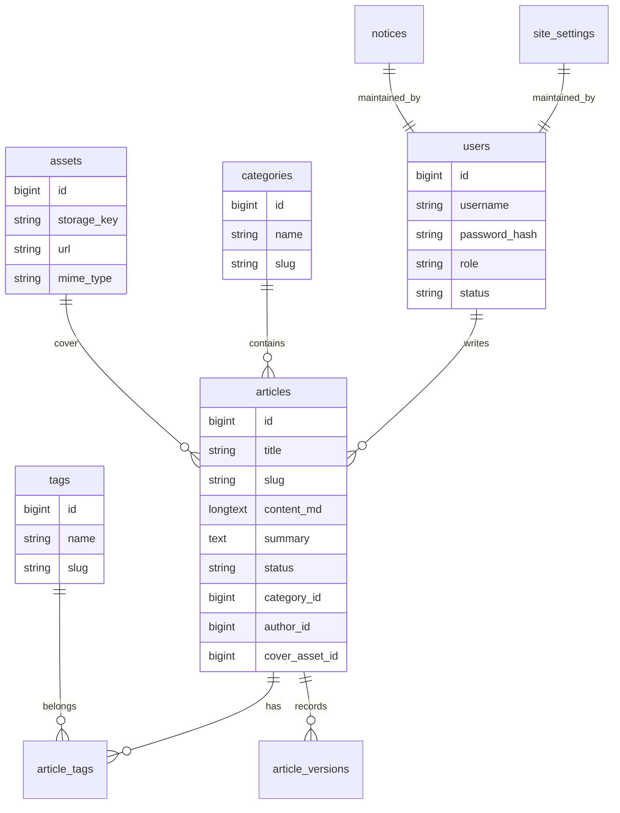

# 数据模型与 API 设计

## 数据建模原则

- MySQL 是文章、分类、标签、媒体、配置的唯一可信数据源。
- Markdown 正文存入 MySQL `longtext`，文件导出作为备份能力，不再作为运行时主数据源。
- 图片文件不再以 Base64 存入数据库，数据库只保存元数据和存储 key。
- 分类和标签使用关系表，不再用字符串拼接。
- 所有表统一保留 `created_at`、`updated_at`，需要软删除的表增加 `deleted_at`。
- 公开 URL 使用 `slug`，内部关系使用自增 ID 或雪花 ID。

## 核心实体



## 表设计建议

### users

管理员用户表。

| 字段 | 类型 | 说明 |
| --- | --- | --- |
| id | bigint unsigned | 主键 |
| username | varchar(64) | 登录名，唯一 |
| nickname | varchar(64) | 昵称 |
| email | varchar(128) | 邮箱，可选 |
| password_hash | varchar(255) | 密码哈希 |
| role | varchar(32) | `owner` / `editor` / `viewer` |
| status | varchar(32) | `active` / `disabled` |
| last_login_at | datetime | 最近登录时间 |
| created_at | datetime | 创建时间 |
| updated_at | datetime | 更新时间 |

### articles

文章表。

| 字段 | 类型 | 说明 |
| --- | --- | --- |
| id | bigint unsigned | 主键 |
| title | varchar(200) | 标题 |
| slug | varchar(220) | 公开 URL，唯一 |
| summary | text | 摘要 |
| content_md | longtext | Markdown 正文 |
| content_html | longtext | 可选，异步渲染后的 HTML |
| toc_json | json | 可选，异步提取目录 |
| status | varchar(32) | `draft` / `published` / `private` / `archived` |
| category_id | bigint unsigned | 分类 ID |
| author_id | bigint unsigned | 作者 ID |
| cover_asset_id | bigint unsigned | 封面图 ID，可空 |
| view_count | bigint unsigned | 阅读量 |
| word_count | int unsigned | 字数 |
| reading_minutes | int unsigned | 预计阅读分钟 |
| is_top | tinyint(1) | 是否置顶 |
| is_featured | tinyint(1) | 是否精选 |
| published_at | datetime | 发布时间 |
| created_at | datetime | 创建时间 |
| updated_at | datetime | 更新时间 |
| deleted_at | datetime | 软删除 |

索引：

- `uk_articles_slug`
- `idx_articles_status_published_at`
- `idx_articles_category_status`
- `idx_articles_author`

### categories

分类表。

| 字段 | 类型 | 说明 |
| --- | --- | --- |
| id | bigint unsigned | 主键 |
| name | varchar(64) | 分类名 |
| slug | varchar(80) | 唯一 slug |
| description | varchar(255) | 描述 |
| sort_order | int | 排序 |
| created_at | datetime | 创建时间 |
| updated_at | datetime | 更新时间 |
| deleted_at | datetime | 软删除 |

### tags

标签表。

| 字段 | 类型 | 说明 |
| --- | --- | --- |
| id | bigint unsigned | 主键 |
| name | varchar(64) | 标签名 |
| slug | varchar(80) | 唯一 slug |
| description | varchar(255) | 描述 |
| color | varchar(32) | 展示颜色 |
| created_at | datetime | 创建时间 |
| updated_at | datetime | 更新时间 |
| deleted_at | datetime | 软删除 |

### article_tags

文章标签关系表。

| 字段 | 类型 | 说明 |
| --- | --- | --- |
| article_id | bigint unsigned | 文章 ID |
| tag_id | bigint unsigned | 标签 ID |
| created_at | datetime | 创建时间 |

联合唯一：

- `uk_article_tag(article_id, tag_id)`

### assets

媒体资源表。

| 字段 | 类型 | 说明 |
| --- | --- | --- |
| id | bigint unsigned | 主键 |
| original_name | varchar(255) | 原始文件名 |
| display_name | varchar(255) | 展示名称 |
| storage_key | varchar(500) | 存储 key |
| url | varchar(500) | 访问 URL |
| thumb_url | varchar(500) | 缩略图 URL |
| mime_type | varchar(100) | MIME |
| ext | varchar(20) | 后缀 |
| size | bigint unsigned | 文件大小 |
| width | int unsigned | 图片宽 |
| height | int unsigned | 图片高 |
| sha256 | char(64) | 内容 hash |
| status | varchar(32) | `ready` / `processing` / `failed` |
| ref_count | int unsigned | 引用数量 |
| created_at | datetime | 创建时间 |
| updated_at | datetime | 更新时间 |
| deleted_at | datetime | 软删除 |

### notices

公告表。

| 字段 | 类型 | 说明 |
| --- | --- | --- |
| id | bigint unsigned | 主键 |
| title | varchar(120) | 标题 |
| content | text | 内容 |
| enabled | tinyint(1) | 是否启用 |
| sort_order | int | 排序 |
| starts_at | datetime | 生效时间 |
| ends_at | datetime | 失效时间 |
| created_at | datetime | 创建时间 |
| updated_at | datetime | 更新时间 |

### site_settings

站点配置表。建议使用 key-value，便于扩展。

| 字段 | 类型 | 说明 |
| --- | --- | --- |
| id | bigint unsigned | 主键 |
| setting_key | varchar(100) | 配置 key，唯一 |
| setting_value | json | 配置值 |
| description | varchar(255) | 描述 |
| created_at | datetime | 创建时间 |
| updated_at | datetime | 更新时间 |

常见 key：

- `site.profile`
- `site.social_links`
- `site.seo`
- `site.about`
- `site.appearance`

### article_versions

文章版本表，用于编辑器回滚。

| 字段 | 类型 | 说明 |
| --- | --- | --- |
| id | bigint unsigned | 主键 |
| article_id | bigint unsigned | 文章 ID |
| title | varchar(200) | 标题快照 |
| content_md | longtext | 正文快照 |
| summary | text | 摘要快照 |
| created_by | bigint unsigned | 操作人 |
| created_at | datetime | 创建时间 |

## API 通用规范

### 路径与版本

接口路径遵循以下规则：

- 不使用全局 `/api` 前缀。
- 不在 URL 中放版本号。
- 版本号统一放到请求头中。
- 按业务模块使用一级前缀，例如 `auth/login`、`user/info`、`setting/lobby`。
- 一级前缀使用单数业务名，例如 `article`、`category`、`tag`、`asset`。
- 列表接口统一以 `list` 或 `*-list` 结尾，便于识别游标分页响应。

版本请求头：

```http
X-API-Version: v1
```

示例：

```text
POST auth/login
GET user/info
GET setting/lobby
GET article/list?cursor=&limit=20
GET article/detail/my-post
```

兼容策略：

- 客户端必须携带 `X-API-Version`。
- 服务端不支持该版本时返回 HTTP `400`，业务码 `20004`。
- 版本升级时保持旧版本 header 可用一段兼容期，避免前端和后端必须同时发布。

### 统一响应

成功响应：

```json
{
  "code": 0,
  "message": "ok",
  "data": {}
}
```

错误响应：

```json
{
  "code": 10001,
  "message": "token expired",
  "data": null
}
```

响应约定：

- `code` 为业务状态码，`0` 表示成功。
- `message` 为稳定、简短、可读的英文信息，不作为前端逻辑判断依据。
- `data` 成功时为对象、数组或具体值；错误时固定为 `null`。
- 列表接口额外返回与 `data` 同级的 `page` 字段。
- 非列表接口不返回 `page` 字段。

分页响应：

所有列表接口固定使用游标分页。列表数据固定放在 `data` 数组中，分页信息固定放在与 `data` 同级的 `page` 字段中。

```json
{
  "code": 0,
  "message": "ok",
  "data": [],
  "page": {
    "cursor": "",
    "next_cursor": "cursor-value",
    "limit": 20,
    "has_more": true
  }
}
```

游标分页规则：

- 请求参数统一使用 `cursor` 和 `limit`。
- `cursor` 为空表示第一页。
- `limit` 默认 `20`，最大 `100`。
- `next_cursor` 为空且 `has_more=false` 表示没有下一页。
- `cursor` 是服务端生成的不透明字符串，前端只保存和回传，不解析其中内容。
- 不返回 `total`、`page`、`pageSize`、`totalPages`，避免大表计数拖慢列表接口。
- 排序必须稳定，推荐使用 `created_at DESC, id DESC` 或业务明确指定的组合键生成游标。
- 游标失效或格式错误时返回 HTTP `400`，业务码 `20003`。

### HTTP 状态码

HTTP 状态码表达协议层语义，业务码表达业务层语义。错误响应仍保持统一 JSON 结构。

| HTTP 状态码 | 使用场景 |
| --- | --- |
| 200 | 请求成功，包含查询、更新、删除、业务动作成功 |
| 201 | 创建成功，例如上传资源或创建文章 |
| 400 | 参数格式错误、缺少版本头、游标非法、JSON 解析失败 |
| 401 | 未登录、token 无效、token 过期 |
| 403 | 已登录但权限不足 |
| 404 | 资源不存在或路由不存在 |
| 409 | 资源冲突，例如 slug 重复、状态冲突 |
| 413 | 请求体或上传文件超过限制 |
| 415 | 不支持的 Content-Type 或文件类型 |
| 422 | 参数格式正确但业务校验失败 |
| 429 | 触发限流 |
| 500 | 服务内部错误 |
| 502 | 上游依赖异常，例如任务网关不可用 |
| 503 | 服务不可用，例如数据库或 Redis 不可用 |

### 业务错误码

错误码按范围划分：

- `0`：成功。
- `10xxx`：认证、授权、账号相关。
- `20xxx`：请求参数、协议、分页、版本相关。
- `30xxx`：资源与业务状态相关。
- `40xxx`：限流、安全策略、上传策略相关。
- `50xxx`：服务端和外部依赖错误。

| code | 含义 |
| --- | --- |
| 0 | ok |
| 10000 | unauthorized |
| 10001 | token expired |
| 10002 | invalid token |
| 10003 | refresh token expired |
| 10004 | forbidden |
| 10005 | invalid credentials |
| 10006 | account disabled |
| 20000 | invalid request |
| 20001 | missing required field |
| 20002 | invalid parameter |
| 20003 | invalid cursor |
| 20004 | unsupported api version |
| 20005 | malformed json body |
| 30000 | resource not found |
| 30001 | resource conflict |
| 30002 | duplicate slug |
| 30003 | invalid resource state |
| 30004 | referenced resource exists |
| 40000 | rate limited |
| 40001 | upload file too large |
| 40002 | unsupported file type |
| 40003 | operation too frequent |
| 50000 | internal server error |
| 50001 | database unavailable |
| 50002 | cache unavailable |
| 50003 | task service unavailable |
| 50004 | storage unavailable |

## 公开 API

### 站点配置

```text
GET setting/lobby
```

返回：

- 站点名称。
- 作者。
- 签名。
- 头像。
- 社交链接。
- SEO 默认配置。

### 首页文章列表

```text
GET article/list?cursor=&limit=20&category=linux&tag=go&keyword=gin
```

只返回 `published` 状态文章。

### 文章详情

```text
GET article/detail/{slug}
```

返回：

- 文章标题。
- Markdown 或 HTML。
- TOC。
- 分类。
- 标签。
- 上一篇/下一篇。
- SEO 信息。

### 归档

```text
GET archive/list?cursor=&limit=20&year=2026
```

按年份、月份聚合已发布文章。

### 分类与标签

```text
GET category/list?cursor=&limit=100
GET tag/list?cursor=&limit=100
GET category/article-list/{slug}?cursor=&limit=20
GET tag/article-list/{slug}?cursor=&limit=20
```

### 公告

```text
GET notice/active
```

### 搜索

```text
GET search/article?keyword=redis&cursor=&limit=20
```

## 后台 API

### 认证

```text
POST auth/login
POST auth/refresh
POST auth/logout
GET  user/info
```

### 仪表盘

```text
GET dashboard/summary
GET dashboard/recent-article-list?cursor=&limit=10
GET dashboard/task-list?cursor=&limit=10
```

### 文章管理

```text
GET    article/manage-list?cursor=&limit=20&status=&category_id=&tag_id=&keyword=
POST   article/create
GET    article/info/{id}
PUT    article/update/{id}
DELETE article/delete/{id}
POST   article/publish/{id}
POST   article/unpublish/{id}
POST   article/version-create/{id}
GET    article/version-list/{id}?cursor=&limit=20
POST   article/version-restore/{id}
```

### 分类标签

```text
GET    category/manage-list?cursor=&limit=100
POST   category/create
PUT    category/update/{id}
DELETE category/delete/{id}

GET    tag/manage-list?cursor=&limit=100
POST   tag/create
PUT    tag/update/{id}
DELETE tag/delete/{id}
```

### 媒体库

```text
GET    asset/list?cursor=&limit=40&keyword=&mime=
POST   asset/upload
PUT    asset/update/{id}
DELETE asset/delete/{id}
GET    asset/reference-list/{id}?cursor=&limit=20
```

### 公告

```text
GET    notice/manage-list?cursor=&limit=20
POST   notice/create
PUT    notice/update/{id}
DELETE notice/delete/{id}
```

### 站点配置

```text
GET setting/detail
PUT setting/update
```

### 任务

```text
GET  task/list?cursor=&limit=20
POST task/rebuild-search-index
POST task/generate-sitemap
POST task/backup
```

## JWT 设计

Access Token claims：

```json
{
  "sub": "1",
  "username": "admin",
  "role": "owner",
  "jti": "uuid",
  "exp": 1710000000,
  "iat": 1709996400
}
```

建议：

- Access Token 有效期 15 到 30 分钟。
- Refresh Token 有效期 7 到 30 天。
- Refresh Token 存服务端记录，支持主动失效。
- 登出时将 access token 的 `jti` 加入 Redis 黑名单直到过期。

## 缓存与失效

| 缓存键 | 内容 | TTL | 失效时机 |
| --- | --- | --- | --- |
| `blog:v1:site:settings` | 公开站点配置 | 10 分钟 | 修改站点配置 |
| `blog:v1:article:detail:{slug}` | 文章详情 | 10 分钟 | 修改/发布/下线文章 |
| `blog:v1:article:list:*` | 文章列表 | 5 分钟 | 修改文章、分类、标签 |
| `blog:v1:taxonomy:categories` | 分类列表 | 30 分钟 | 修改分类 |
| `blog:v1:taxonomy:tags` | 标签列表 | 30 分钟 | 修改标签 |
| `blog:v1:archives` | 归档 | 30 分钟 | 发布/下线文章 |
| `blog:v1:notice:active` | 当前公告 | 5 分钟 | 修改公告 |
| `blog:v1:views:article:{id}` | 阅读量增量 | 定时落库 | Celery 聚合后清理 |

## 旧数据迁移方案

迁移来源：

- SQLite：`blog-mini-serve/instance/BlogMini.sqlite`
- Markdown：`blog-mini-serve/articles/*.md`
- 图片：`blog-mini-serve/pics/*`

迁移步骤：

1. 编写迁移脚本读取 SQLite 表。
2. 创建默认管理员用户。
3. 迁移 `ArticleTypes` 到 `categories`。
4. 迁移 `ArticleLabels` 到 `tags`。
5. 迁移 `Articles` 到 `articles`。
   - 将旧状态 `0/1/2` 映射为 `draft/published/private`。
   - 将标题生成稳定 slug。
   - 优先使用数据库内容，若为空则读取 Markdown 文件。
6. 解析旧 `article_label` 字符串，写入 `article_tags`。
7. 迁移 `PicBed` 到 `assets`。
   - 文件存在则读取文件。
   - 文件不存在但 DB 有 Base64 时解码生成文件。
8. 迁移 `BlogConfig` 到 `site_settings`。
9. 迁移 `BlogNotice` 到 `notices`。
10. 触发 Celery 任务重建摘要、目录、搜索索引、sitemap 和 RSS。
