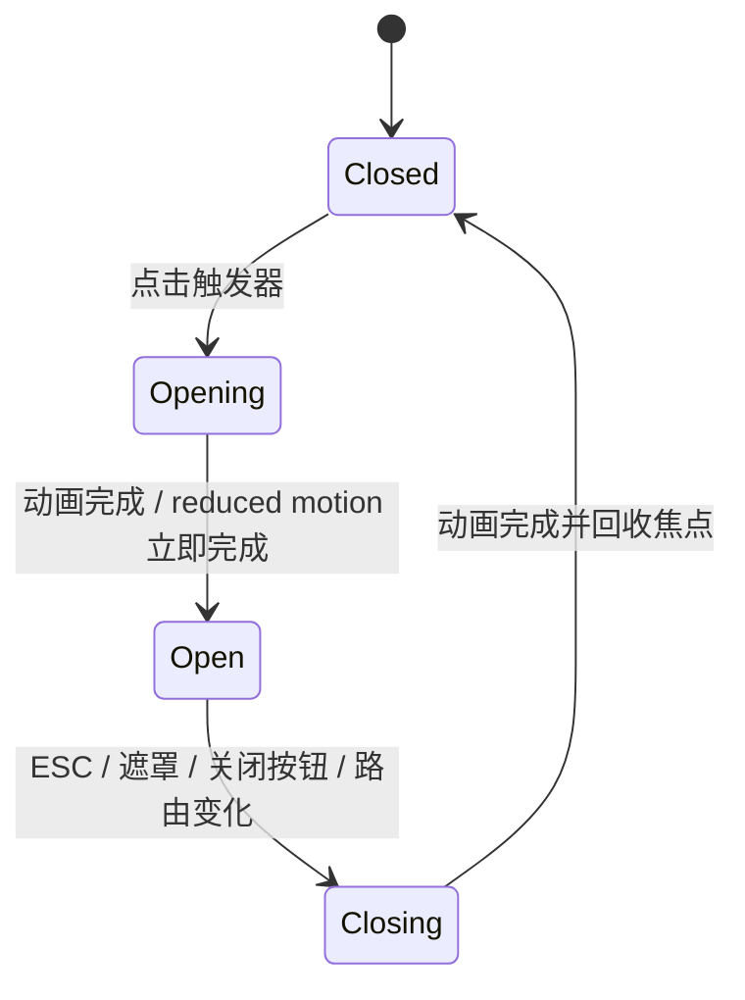

# 布局模式

本文是 Solitude Blog 页面骨架、响应式行为和浮层层级的实施基线，适用于 `web/` 下的 Vue 3 + TypeScript + Sass 前端。

具体颜色、颜色派生和主题阴影色以 [雾境二维主题色调系统](./11-theme-color-system.md) 为准；token 契约、圆角、阴影几何和组件状态以 [UI 设计系统](./09-ui-design-system.md) 为准；BEM 与工程组织以 [编码设计](./06-coding-design.md) 为准。本文只定义布局职责、尺寸关系、断点行为和可验证结果。

本项目自主采用可折叠 Shell、玻璃内容壳和自适应卡片网格，并明确禁止 Float 主布局、固定大宽高、单一粗断点、重阴影或页面级背景图依赖。

## 1. 规范级别与目标

文中的“必须”“禁止”是验收要求，“应”是默认方案；偏离“应”时，需要在代码评审中说明原因。

| 目标 | 规则 |
| --- | --- |
| 流式优先 | 页面宽度由 `minmax()`、`clamp()` 和最大可读宽度约束，不按某张设计稿固定像素 |
| 骨架清晰 | CSS Grid 负责页面和区域骨架，Flex 负责单行或组件内部排列 |
| 阅读优先 | 公开页面由 `document` 负责纵向滚动；代码块和表格各自处理横向溢出，不用全屏内嵌滚动卡 |
| 层级克制 | 氛围背景、玻璃内容壳、内容卡最多形成两层主要表面，避免“玻璃套玻璃” |
| 主题解耦 | 布局组件只消费 `--bg-*`、`--text-*`、`--accent*`、`--border*`、`--shadow-*` 等语义 token |
| 移动可用 | 侧栏转抽屉、目录转底部面板、表格转卡片或局部横向滚动，页面本身不得横向滚动 |
| 可访问 | 浮层支持 ESC、焦点圈定与回收、滚动锁定；视觉顺序与 DOM/键盘顺序保持一致 |

明确禁止：

- 使用 `float`、负外边距或绝对定位搭建主布局。
- 为普通页面设置 `height: 100vh` 并隐藏正文溢出。
- 用 `left: 250px`、`margin-left: 80px` 等补偿侧栏宽度。
- 在业务页面硬编码主题颜色、阴影、圆角或任意 z-index。
- 仅隐藏文字来实现侧栏折叠，却仍让不可见链接可聚焦。
- 为移动端复制另一套页面 DOM；同一语义结构应由 Grid、抽屉和组件状态适配。

## 2. 当前实现映射

路由入口位于 `web/src/router/public.routes.ts` 与 `web/src/router/admin.routes.ts`，布局样式统一由 `web/src/styles/index.scss` 引入。

| 场景 | Vue 落点 | Sass 落点 | 当前能力 | 本规范要求 |
| --- | --- | --- | --- | --- |
| 公共壳层 | `layouts/public/PublicLayout.vue`、`components/blog/BlogNavbar.vue` | `_layout.scss`、`_navbar.scss`、`themes/_mist.scss` | 全宽 72px 玻璃顶栏、编辑式页脚、Backtop、可访问移动抽屉 | 保持抽屉焦点管理、滚动锁、动态品牌和窄屏重排 |
| 首页 | `pages/public/HomePage.vue`、`components/blog/ArticleCard.vue` | `_home.scss` | 7/5 作者舞台、一主两辅文章目录、连续文章流、专题横条 | 860/640px 按内容优先级重排，首屏只保留一个 luminous 焦点 |
| 文章详情 | `pages/public/ArticleDetailPage.vue`、`components/blog/BlogToc.vue` | `_article.scss`、`_effects.scss` | 7/5 标题舞台、宽封面、760px 正文、220px TOC、阅读进度与移动目录 | 保持正文安静、当前章节语义和 960px 单栏切换 |
| 归档 | `pages/public/ArchivesPage.vue` | `_archives.scss` | 7/5 归档 Hero、sticky 年份轨道、连续年/月时间线 | 年份锚点同步 `aria-current`，窄屏不产生整页横滚 |
| 搜索 | `pages/public/SearchPage.vue` | `_search.scss` | 数据 Hero、strong workbench、查询 chips、编号结果与内容海图 | URL 状态为唯一查询入口，加载/空/错/分页互斥 |
| 关于 | `pages/public/AboutPage.vue` | `_about.scss` | 7/5 作者 Hero、原则流和动态联系区 | 不伪造履历或实时状态，社交协议必须经过白名单过滤 |
| 后台 Shell | `layouts/admin/AdminLayout.vue` | `_admin.scss` | 240/76px 全高侧栏、72px 顶栏、960px 抽屉、全局文章搜索 | 保持折叠与移动抽屉正交，主区不使用偏移补偿 |
| 后台页面 | `pages/admin/*.vue` | `_layout.scss`、`_admin.scss` | Grid 工具栏、表格、编辑器、媒体卡片 | 主区 `min-width: 0`；窄屏卡片化或局部滚动 |
| 登录 | `pages/admin/LoginPage.vue` | `_admin.scss` | 宽屏编辑式双栏、窄屏单列登录表单 | 使用动态视口与安全内边距，软键盘下允许自然滚动 |
| 主题系统 | `composables/useTheme.ts`、`stores/setting.ts` | `tokens/`、`themes/_mist.scss` | 后台主题色 × 访客明暗 | 四种组合只改变视觉 token，不改变布局尺寸与内容顺序 |

Sass 职责必须收敛：

- `_layout.scss`：共享容器、公共壳层和跨页面排版原语。
- `_navbar.scss`：公开导航、移动导航、页脚。
- `_home.scss`、`_article.scss`、`_archives.scss`、`_search.scss`、`_about.scss`：对应公开页面。
- `_admin.scss`：后台壳层、后台页面布局和后台响应式规则。
- `_effects.scss`：阅读进度、动效降级等跨页面效果。

同一选择器不得依赖 `index.scss` 的导入顺序在多个文件中反复覆盖。公共壳层、后台壳层和页面 block 已按上述职责收敛；新增样式继续遵守单一权威文件规则。

## 3. 布局 token 与容器

### 3.1 尺寸 token

以下值是布局层单一事实来源，应加入 `web/src/styles/tokens/_base.scss`；媒体查询断点使用 Sass 常量，不能使用 CSS 自定义属性。

| Token | 基准值 | 用途 |
| --- | ---: | --- |
| `--layout-page-max` | `1120px` | 公开页面最大宽度 |
| `--layout-admin-max` | `1280px` | 后台工作区最大宽度 |
| `--layout-reading-max` | `760px` | 正文和文章头最大可读宽度 |
| `--layout-rail` | `240px` | TOC / 辅助栏基准宽度 |
| `--layout-shell-expanded` | `240px` | 后台桌面 Shell 展开宽度 |
| `--layout-shell-collapsed` | `76px` | 后台桌面 Shell 折叠宽度 |
| `--layout-public-header` | `72px` | 公开顶栏基准高度 |
| `--layout-admin-header` | `64px` | 后台顶栏基准高度 |
| `--layout-gutter` | `clamp(16px, 3vw, 32px)` | 页面水平安全边距 |

公共容器统一写法：

```scss
.layout-container {
  width: min(
    var(--layout-page-max),
    calc(100% - var(--layout-gutter) - var(--layout-gutter))
  );
  min-width: 0;
  margin-inline: auto;
}
```

禁止在 Grid 子项上使用 `width: calc(100vw - 32px)`；它不会扣除相邻 Grid 列，容易制造页面横向滚动。Grid 子项统一设置 `min-width: 0`，宽度使用 `100%` 或最大容器约束。

### 3.2 玻璃内容壳

玻璃效果用于顶栏、首页主壳、后台顶栏/侧栏和浮层。正文、表格单元格与每一层小卡片不重复模糊背景。

```scss
.content-shell {
  border: 1px solid var(--border);
  border-radius: var(--radius-xl);
  background: var(--bg-card); // 不支持 backdrop-filter 时的可靠回退
  box-shadow: var(--shadow-md);
}

@supports (color: color-mix(in srgb, white, black)) {
  .content-shell {
    border-color: color-mix(in srgb, var(--border) 76%, transparent);
  }
}

@supports (backdrop-filter: blur(1px)) {
  .content-shell {
    background: var(--surface-glass);
    backdrop-filter: blur(var(--glass-blur-lg)) saturate(var(--glass-saturation));
  }
}
```

规则：

- 小型粘性表面使用 `14px`，侧栏使用 `24px`，导航使用 `30px`，一个页面只允许主玻璃壳使用 `32px`；雾层可使用 40/60/80px 的静态 blur，但不得通过动态 blur 掩盖对比度问题。
- 页面氛围由 `.mist-page` 的八层光场、光照渐变与雾幕产生，不依赖固定背景图。
- 暗色模式仍使用相同结构，只由 token 改变表面、边框和阴影。
- 卡片 hover 最多上移 2px；触屏与 `prefers-reduced-motion` 下不依赖位移动效表达状态。

### 3.3 自适应卡片网格

首页小组件、后台指标和媒体资源统一复用 `auto-fit + minmax()` 自适应模式：

```scss
.card-grid {
  --card-min: 240px;
  display: grid;
  grid-template-columns: repeat(
    auto-fit,
    minmax(min(100%, var(--card-min)), 1fr)
  );
  gap: var(--space-5);
}

.card-grid--metric { --card-min: 176px; }
.card-grid--media { --card-min: 220px; }
```

卡片数量变化时不得新增列数 class；最小卡宽由变体控制。只有具有同等语义和高度预期的卡片才放入同一网格。

## 4. 公共壳层

公共站点使用顶部导航，不把后台 Shell 强加到阅读场景；整体结构固定为“sticky 导航 + 流式主区 + 页脚”。

```text
┌────────────────────── viewport ──────────────────────┐
│ BlogNavbar（sticky，玻璃表面，72px 基准）             │
├───────────────────────────────────────────────────────┤
│                                                       │
│  PublicLayout.main                                    │
│  ┌──────────── max 1120 / fluid gutter ────────────┐ │
│  │ RouterView：Home / Article / Archives / Search / About │ │
│  └──────────────────────────────────────────────────┘ │
│                                                       │
├───────────────────────────────────────────────────────┤
│ PublicFooter（正常文档流，不 sticky）                  │
└───────────────────────────────────────────────────────┘
```

推荐结构：

```vue
<div class="public-layout mist-page">
  <a class="skip-link" href="#main-content">跳到主内容</a>
  <BlogNavbar />
  <main id="main-content" class="public-layout__main" tabindex="-1">
    <RouterView />
  </main>
  <PublicFooter />
</div>
```

实施规则：

- `.public-layout` 至少为 `min-height: 100vh; min-height: 100dvh`，不得固定高度。
- 顶栏 sticky 时，主内容不再增加同高的占位 margin；sticky 元素保留在文档流中。
- 导航 inner 与页面 inner 共享 `--layout-page-max` 和 `--layout-gutter`，避免边线错位。
- `.skip-link` 默认移出视觉区域，获得焦点时显示在 `--z-dropdown` 层。
- 页脚随内容自然下移；短页面可由根壳 `display: grid; grid-template-rows: auto 1fr auto` 推至底部。
- `RouterView` 的直接页面根必须 `min-width: 0`。

## 5. 首页

首页采用 demo 的作者主导编辑式舞台，不再使用旧“作者 / feed / rail”三栏工作台。首屏唯一焦点是作者与站点身份；最近文章在下一节形成一主两辅目录，继续向下则回到安静的连续文章流。

```text
桌面
┌──────────────────────────────────────────────────────┐
│ 7fr luminous 作者身份          │ 5fr 博客说明与指标  │
├──────────────────────────────────────────────────────┤
│ 7fr featured article           │ 5fr 两篇近期文章    │
├──────────────────────────────────────────────────────┤
│ 其余文章连续列表（共享分隔，不重复玻璃）             │
├──────────────────────────────────────────────────────┤
│ 专题横条 → 可选站点公告                              │
└──────────────────────────────────────────────────────┘

≤ 860px：Hero 与文章目录单列；两篇辅文章并列
≤ 640px：全部单列，作者头像、标题和操作居中重排
```

核心骨架：

```scss
.home-stage,
.home-catalog {
  display: grid;
  grid-template-columns: minmax(0, 7fr) minmax(300px, 5fr);
  gap: var(--space-8);
}

.home-stage__profile {
  min-height: 460px;
  border-radius: var(--radius-xl);
}
```

内容优先级与响应式规则：

1. `.home-stage__profile` 是首屏唯一 luminous 表面；右侧站点说明直接落在背景留白上。
2. 第一篇文章使用 featured 变体和主题插图，第二、三篇使用 compact/offset；第四篇起使用共享分隔的 stream 变体。
3. 文章、分类、标签、公告和社交链接都来自现有 API/setting；不得为保持构图伪造计数或文章。
4. loading、error、empty 和加载更多位于文章章节内部，不改变 Hero 尺寸，也不与旧结果重叠。
5. 小于 860px 先把主轮廓重排为单列；小于 640px 再取消偏移和并排辅文章，DOM 顺序始终等于阅读顺序。
6. 专题入口由真实分类与标签补足到最多三项；没有数据时整个专题区隐藏，不显示假分类。
7. 首页不使用固定内容高度；仅 Hero 在桌面使用视口相关的 `min-height` 建立舞台，窄屏恢复自然高度。

## 6. 文章详情

文章页的目标是稳定可读：标题区使用 7/5 编辑式舞台承载标题与事实数据，正文回到安静阅读流，不把整篇文章放入玻璃卡。

```text
┌──────────────────── article page max 1120 ────────────────────┐
│ 7fr 标题 / 摘要                    │ 5fr 阅读事实             │
├───────────────────────────────────────────────────────────────┤
│ 主题宽封面                                                      │
├───────────────────────────────────────┬───────────────────────┤
│ markdown（max 760，minmax(0, 1fr)）   │ TOC 220 sticky        │
├───────────────────────────────────────┴───────────────────────┤
│ 作者尾注 → previous / next                                   │
└───────────────────────────────────────────────────────────────┘
```

```scss
.article-detail__layout {
  display: grid;
  grid-template-columns: minmax(0, var(--layout-reading-max)) minmax(200px, 240px);
  justify-content: center;
  align-items: start;
  gap: clamp(var(--space-5), 4vw, var(--space-10));
}

.markdown-body {
  min-width: 0;
  max-width: var(--layout-reading-max);
  font-family: var(--font-serif);
  font-size: var(--text-md);
  line-height: var(--leading-relaxed);
}
```

实施规则：

- 正文可读列最大 760px；标题 Hero 可使用完整 1120px 网格，但摘要仍限制在约 60ch。
- TOC `top` 等于公开顶栏高度加一档间距；标题锚点使用相同 `scroll-margin-top`。
- 小于 960px 时隐藏桌面 TOC 列并启用 `.toc-fab`；目录以底部面板打开，不在正文顶部插入长目录。
- 代码块、宽表格各自 `overflow-x: auto`，并显示可发现的滚动条；禁止给 `.article-detail-page` 设置横向滚动。
- 图片 `max-inline-size: 100%`、`block-size: auto`；超长 URL 使用 `overflow-wrap: anywhere`。
- 阅读进度条位于 72px 顶栏下方，使用 `calc(var(--z-sticky) + 1)` 且 `pointer-events: none`；滚动、resize 和内容 reflow 都要重新计算。
- 上一篇/下一篇桌面双列，小于 640px 单列；链接标题不可因固定高度截断。
- 文章加载、失败、不存在状态与正文共用相同容器宽度，避免加载完成时大幅横向跳动。

当前实现已在 960px 前后切换 desktop TOC 与 `.toc-drawer`，目录具备 `aria-modal`、显式关闭、焦点圈定/回收、当前章节 `aria-current="location"` 与锚点标题聚焦。

## 7. 归档

归档采用“数据 Hero → sticky 年份轨道 → 连续时间线”。年份和月份由数据层降序生成，页面不再把每一年包成同亮度玻璃卡。

| 区域 | 桌面 | 小于 640px |
| --- | --- | --- |
| 页面宽度 | 最大 1120px | 流式，16px gutter |
| 年份导航 | sticky 横向轨道 | 局部横向滚动，不推动 body |
| 年区块 | 年份轴 + 共享内容流 | 单列自然文档流 |
| 条目 | 日期 / 标题 / 分类三轴 | 日期 / 标题两轴，分类移至标题下方 |

实施规则：

- 年份降序、月份降序、日期降序由 Vue 数据层保证；CSS 不改变语义顺序。
- 年份锚点和年份 section 使用 `scroll-margin-top`；IntersectionObserver 同步年份轨道的 `aria-current="location"`。
- `.archives-entry` 的日期使用 tabular numbers；标题列必须 `min-width: 0`。
- hover 的横向移动最多 4px，并在 reduced motion 下取消；focus-visible 必须获得同等高亮。
- empty/loading/load-more 放在归档主容器中，不创建新的全屏滚动区。

直接访问年份 hash 时恢复位置；点击年份后焦点进入对应年份标题。loading、error、empty、局部分页失败与加载更多继续共用同一归档流。

## 8. 搜索

搜索页采用“数据 Hero → strong 搜索工作台 → 编号结果 / 内容海图”的工作台轮廓。搜索表单仍是核心任务，Hero 统计和海图只作为结果理解的辅助焦点。

```scss
.search-workbench__form {
  display: grid;
  grid-template-columns: minmax(0, 1fr) auto;
  gap: var(--space-3);
}

@media (max-width: 639px) {
  .search-workbench__form {
    grid-template-columns: 1fr;
  }
}
```

实施规则：

- 关键词写入 `?q=`，刷新和分享后可恢复；新查询时结果区保持稳定最小高度。
- 搜索按钮移动端占满可用宽度，输入框与按钮触控高度至少 44px。
- 航标 chips 写入同一 `?q=` 状态机，并用 `aria-pressed` 表达当前查询；清空按钮显式命名。
- 结果使用连续编号列表而非同亮度卡片；命中片段使用 `<mark>`，颜色不是唯一提示。
- loading、error、empty、initial 四种状态占用同一区域；错误状态提供重试路径。
- 结果标题和摘要允许自然换行；标签区域使用 Flex wrap，不固定列宽。
- 右侧内容海图由当前结果动态计算；没有结果时不伪造分布。
- 搜索建议浮层若后续加入，应位于 `--z-dropdown`，限制高度并局部滚动，不改变页面布局。

## 9. 后台 Shell 与页面

后台采用可折叠 Shell 信息架构；Shell 作为 Grid 列参与布局，不使用 fixed + 内容偏移补偿。

```text
桌面展开                         桌面折叠
┌──────────────────────────┐     ┌──────────────────────────┐
│ Shell 240 │ topbar 64px  │     │ 76 │ topbar 64px         │
│ brand/nav ├──────────────┤     │icon├─────────────────────┤
│ account   │ main         │     │rail│ main                │
│ own scroll│ min-width: 0 │     │    │ min-width: 0        │
└───────────┴──────────────┘     └────┴─────────────────────┘

< 960px
┌──────────────────────────┐
│ topbar + hamburger       │
├──────────────────────────┤
│ main                     │◀── left drawer + scrim
└──────────────────────────┘
```

桌面骨架：

```scss
.admin-layout {
  --admin-shell-size: var(--layout-shell-expanded);
  display: grid;
  min-height: 100vh;
  min-height: 100dvh;
  grid-template:
    'sidebar topbar' var(--layout-admin-header)
    'sidebar main' minmax(0, 1fr)
    / var(--admin-shell-size) minmax(0, 1fr);
  transition: grid-template-columns var(--transition-base);
}

.admin-layout.is-shell-collapsed {
  --admin-shell-size: var(--layout-shell-collapsed);
}

.admin-layout__sidebar {
  position: sticky;
  top: 0;
  block-size: 100dvh;
  overflow-y: auto;
  overscroll-behavior: contain;
}

.admin-layout__main {
  min-width: 0;
  padding: clamp(var(--space-4), 3vw, var(--space-8));
  overflow-x: clip;
}
```

Vue 状态约定：

```vue
<div
  class="admin-layout"
  :class="{
    'is-shell-collapsed': shellCollapsed,
    'is-drawer-open': drawerOpen,
  }"
>
  <button
    type="button"
    aria-controls="admin-sidebar"
    :aria-expanded="isNarrow ? drawerOpen : !shellCollapsed"
    @click="toggleShell"
  >
    <span class="sr-only">{{ toggleLabel }}</span>
  </button>
  <aside id="admin-sidebar" class="admin-layout__sidebar">…</aside>
</div>
```

规则：

- 桌面展开 240px、折叠 76px；折叠偏好可保存为 `blog:admin-shell`，但移动抽屉开关不得持久化。
- 折叠态保留 SVG 图标，文本标签从布局和焦点可见名称中妥善处理；图标链接必须有 `aria-label` 或可访问 tooltip。
- 侧栏承载品牌、分组导航、查看博客和账户；顶栏承载当前页名、文章搜索、网络状态和明暗模式。
- Shell 折叠按钮属于 topbar 或 Shell 边界，但点击目标至少 44×44px；不得复用 25×25px 圆点。
- Shell 和主区由 Grid 自动重排，禁止对 main 添加 `margin-left`。
- 960px 以下不显示 76px rail，统一变为左侧抽屉；路由切换后自动关闭。
- 后台 `.admin-page` 使用 `width: min(var(--layout-admin-max), 100%)`，所有 Grid 直接子项 `min-width: 0`。
- Dashboard 使用“欢迎区 → 最近编辑/公告唯一焦点 → 共享指标带 → 8/4 内容流”，不得退化为所有指标和内容同亮度的卡片墙。
- 媒体使用自适应网格；编辑器主栏/设置栏使用 `minmax(0,1fr) 280px`，小于 1200px 时设置栏进入正常文档流。
- 数据表格在 960px 以下优先改为有字段标签的卡片行；字段不适合卡片化时，仅 `.admin-table__scroller` 横向滚动，不能让 body 横向滚动。
- 危险操作和状态不可只靠颜色；按钮、确认层和错误说明遵循 UI 设计系统。

当前实现已区分 `shellCollapsed` 与移动 `drawerOpen`，并保存桌面折叠偏好；抽屉通过 Teleport、scrim、inert、ESC、焦点圈定/回收和滚动锁构成完整状态机。顶栏搜索使用 `?keyword=` 与文章列表同步。

## 10. 登录

登录是单任务页面，使用柔和氛围和玻璃表面。宽屏允许采用 demo 式编辑介绍栏 + 表单栏，窄屏必须回到单列；任何尺寸都不固定视口宽高。

```scss
.login-page {
  display: grid;
  min-height: 100vh;
  min-height: 100dvh;
  place-items: center;
  padding:
    max(var(--space-4), env(safe-area-inset-top))
    max(var(--space-4), env(safe-area-inset-right))
    max(var(--space-4), env(safe-area-inset-bottom))
    max(var(--space-4), env(safe-area-inset-left));
}

.login-card {
  width: min(980px, 100%);
  grid-template-columns: minmax(0, 1.08fr) minmax(340px, .92fr);
}
```

实施规则：

- 外壳最大 980px，表单列保持约 340–420px；视口不足时自然缩放，软键盘弹出后页面允许纵向滚动。
- 不使用 `position: absolute + transform` 居中，也不固定 card 高度。
- 首个字段、提交中、错误、禁用状态不能改变卡片宽度；错误文本在表单内就近显示并使用 `aria-live`。
- 登录失败后焦点移到错误摘要或第一个错误字段；提交中仍保留可理解的按钮名称。
- 桌面介绍栏只使用语义 token 和主题光场；小屏完全移除介绍栏且不复制表单。

当前 `.login-page` 已使用 `100vh/100dvh` 回退、安全区内边距和纵向滚动；真实 320px、矮屏与移动键盘仍属于浏览器验收矩阵。

## 11. 移动抽屉与底部面板

项目有三类浮层导航：

| 浮层 | 方向 | 触发点 | 宽/高 |
| --- | --- | --- | --- |
| 公开导航 `.navbar-drawer` | 右侧抽屉 | `< 768px` | `min(320px, calc(100vw - 48px))` |
| 后台导航 `.admin-layout__sidebar` | 左侧抽屉 | `< 960px` | `min(300px, calc(100vw - 48px))` |
| 文章目录 `.toc-drawer` | 底部面板 | `< 960px` | 最大 `70dvh`，含 safe area |

所有抽屉必须遵循同一状态机：



打开时必须：

1. 记录触发按钮，并把焦点移到面板标题、关闭按钮或首个链接。
2. 设置 `role="dialog"`、`aria-modal="true"` 和可解析的 `aria-labelledby`。
3. 对主内容应用 `inert`，或使用可靠的焦点圈定实现 Tab 循环。
4. 锁定背景滚动并保留原滚动位置；面板自身 `overflow-y: auto`、`overscroll-behavior: contain`。
5. 提供显式关闭按钮；遮罩点击和 ESC 只是附加路径。

关闭时必须：

- 移除滚动锁和 `inert`。
- 把焦点还给原触发按钮；若触发按钮已卸载，则聚焦页面主标题或 main。
- 清理 keydown 监听；Vue 组件卸载时不得残留 body 样式。

建议使用 `<Teleport to="body">` 渲染抽屉和遮罩。`backdrop-filter`、`transform`、sticky header 都会创建 stacking context，浮层留在 `BlogNavbar` 内部时，即使设置较高 z-index 也无法逃出父层级。

正式控制图标使用 SVG/Icon 组件；不得用 emoji 充当菜单、关闭、主题和目录图标。纯装饰图形设置 `aria-hidden="true"`。

## 12. 响应式断点

断点按内容失效点定义，不按具体设备品牌定义。新代码采用 mobile-first；维护现有 max-width 规则时必须与下表产生同等行为。

```scss
$bp-sm: 640px;
$bp-nav: 768px;
$bp-shell: 960px;
$bp-wide: 1200px;
```

| 范围 | 页面行为 |
| --- | --- |
| `< 640px` | 单列；gutter 16px；搜索按钮满宽；归档元数据收紧；文章前后导航单列；后台工具栏堆叠 |
| `640–767px` | 主轮廓仍为单列；首页两篇辅文章可并排；卡片网格由可用宽度自动决定列数 |
| `768–860px` | 公开顶栏显示完整导航；公开页 Hero 仍按单列阅读；后台使用抽屉；文章使用 TOC 底部面板 |
| `861–959px` | 首页与关于页恢复 7/5 构图；归档、搜索恢复主辅双区；后台仍用抽屉；文章仍用 TOC 底部面板 |
| `960–1199px` | 文章显示桌面 TOC；后台 Shell 内联并可折叠；仪表盘与编辑器按内容宽度使用主辅列 |
| `≥ 1200px` | 保持 7/5 编辑式构图与连续内容流；后台 Shell 展开并使用完整工作台宽度 |

补充规则：

- 宽度 320px 是硬性最低验收点，不代表页面设置固定 `min-width: 320px` 后即可通过。
- 高度断点只用于处理矮屏抽屉和 sticky 区域，不隐藏核心操作。
- 优先使用 `clamp()` 和 `auto-fit` 平滑变化；只有结构变化才使用媒体查询。
- 组件嵌入宽度可能与视口不同的场景，应优先使用 container query；页面 Shell 仍使用上述 viewport 断点。
- 不再新增 1080、1530 等一次性断点；确有内容失效证据时，先更新本文再实现。

## 13. z-index 与叠层

现有 `web/src/styles/tokens/_base.scss` 的层级保持为单一事实来源：

| 层级 | Token / 值 | 用途 |
| --- | ---: | --- |
| 文档流 | `0` | 页面、卡片、正文 |
| 局部浮起 | `1` | 卡片伪元素，不越过所在组件 |
| sticky | `--z-sticky: 10` | 顶栏、桌面 sticky 工具 |
| 阅读进度 | `calc(var(--z-sticky) + 1)` | 顶部 2px 进度条 |
| dropdown | `--z-dropdown: 50` | 搜索建议、非模态菜单、skip link |
| scrim | `calc(var(--z-modal) - 1)` | 模态遮罩 |
| modal | `--z-modal: 100` | 抽屉、底部面板、对话框 |
| toast | `--z-toast: 200` | 全局通知 |

规则：

- 禁止在页面 Sass 中写 `999`、`9999` 等临时值。
- dropdown 被 modal 打开后必须关闭或留在 modal 内，不得越过 modal。
- Toast 可高于 modal，但不得抢焦点或遮挡 modal 关闭按钮。
- `transform`、`filter`、`opacity < 1`、`backdrop-filter` 会创建 stacking context；跨组件浮层使用 Teleport，而不是继续增大 z-index。

## 14. 滚动、焦点与动效

### 14.1 滚动所有权

| 场景 | 滚动容器 |
| --- | --- |
| 公开首页、归档、搜索、文章 | `document` |
| 后台主内容 | 默认 `document`；只有表格/代码/选择列表可局部滚动 |
| 桌面后台 Shell | sidebar 自身纵向滚动，`overscroll-behavior: contain` |
| 抽屉 / TOC 面板 | panel 自身滚动，背景锁定 |
| Markdown 代码块 / 宽表格 | 元素自身横向滚动 |

不得隐藏 sidebar、代码区或抽屉的滚动条来换取外观整洁。可用主题 token 调整颜色与圆角，但需保留可发现性。

全局锚点偏移：

```scss
html {
  scroll-padding-top: calc(var(--layout-public-header) + var(--space-4));
}

[id] {
  scroll-margin-top: calc(var(--layout-public-header) + var(--space-4));
}
```

`web/src/router/index.ts` 的 `scrollBehavior` 应保留浏览器返回位置和 hash 定位：

```ts
scrollBehavior(to, _from, savedPosition) {
  if (savedPosition) return savedPosition
  if (to.hash) return { el: to.hash, top: 88 }
  return { top: 0 }
}
```

平滑与否交给全局 `scroll-behavior` 控制，使 `prefers-reduced-motion` 能统一关闭动画。

### 14.2 焦点

- 所有按钮、链接、输入、抽屉关闭按钮必须有清晰 `:focus-visible`，统一使用 `--focus-ring`。
- hover 才出现的操作，也必须在 `:focus-within` 下出现。
- 路由变化后，将焦点移动到 `#main-content` 或页面 `h1`；不得只把滚动位置置顶。
- sticky 顶栏不得覆盖被聚焦元素；锚点与表单错误都使用 scroll margin。
- 折叠 Shell 的 tooltip 可被键盘触发，且不能成为唯一可访问名称。

### 14.3 动效降级

当前 `_effects.scss` 的平滑滚动和 hover lift 必须补充降级：

```scss
@media (prefers-reduced-motion: reduce) {
  html {
    scroll-behavior: auto;
  }

  *,
  *::before,
  *::after {
    animation-duration: 0.01ms !important;
    animation-iteration-count: 1 !important;
    transition-duration: 0.01ms !important;
  }
}
```

抽屉在 reduced motion 下直接切换最终状态；状态变化不能只靠位移或颜色表达。

## 15. BEM 与状态命名

项目使用“独立 block + BEM 元素 + 显式状态”：

| 类型 | 示例 | 规则 |
| --- | --- | --- |
| Block | `.admin-layout`、`.home-stage`、`.toc-drawer` | 能独立描述职责，使用 kebab-case |
| Element | `.admin-layout__sidebar`、`.toc-drawer__panel` | 只用一层 `__`，不串联 DOM 全路径 |
| Modifier | `.card-grid--media`、`.mist-card--bordered` | 稳定视觉/尺寸变体使用 `--` |
| State | `.is-open`、`.is-shell-collapsed`、`.is-loading` | 瞬时运行状态使用 `is-*` |
| Theme | `[data-theme='mist-forest'][data-mode='dark']` | 组合选择器仅出现在 token 文件；不写 `.dark-card`、`.forest-sidebar` |

禁止 `.left`、`.right`、`.close`、`.CardDark` 等依赖位置或主题的通用类。Sass 嵌套不超过三层，避免把 DOM 层级固化进选择器。

Vue 中布局 class 必须直接可搜索：

```vue
<aside
  class="admin-layout__sidebar"
  :class="{ 'is-open': drawerOpen }"
  aria-label="后台导航"
>
  <RouterLink class="admin-layout__nav-item" to="/admin/articles">
    <ArticleIcon aria-hidden="true" />
    <span class="admin-layout__nav-label">文章管理</span>
  </RouterLink>
</aside>
```

禁止把关键布局长期留在 inline `style` 中。当前 `PublicLayout.vue`、`AdminLayout.vue` 和 `ArchivesPage.vue` 的少量 inline 布局应迁回对应 BEM class；动态进度宽度、用户配置颜色等真正运行时值可继续通过 CSS 自定义属性传入。

## 16. 当前实现偏差清单

本文描述目标布局，不能据此把现有页面直接标记为已完成浏览器验收。2026-07-15 的 demo 迁移已关闭旧首页、壳层、搜索竞态和三类抽屉状态机偏差；当前仍保留以下明确欠账。

| 优先级 | 当前实现 | 目标与验收 |
| --- | --- | --- |
| P1 | 文章上一篇/下一篇仍通过额外拉取最多 200 篇文章推导 | 详情 API 直接返回相邻文章，避免大归档下缺失相邻项与额外请求 |
| P1 | About 已实现，但 Category、Tag 仍只有搜索入口，没有独立公开路由 | 有明确产品需求时按公共壳层新增；在此之前保留搜索查询作为唯一入口 |
| P1 | 当前会话没有可用浏览器实例，尚未执行 320–1440px、四主题组合、200% 缩放和截图对比 | 在可用浏览器中按第 18 节完成真实视觉、键盘和读屏抽查，不以构建通过替代 |
| P2 | 前端仍缺少自动化组件与路由交互测试 | 为主题控制、三类抽屉、搜索 URL 状态和后台全局搜索建立测试基线 |

独立于布局的组件、token 和主题偏差统一记录在 [UI 设计系统](./09-ui-design-system.md#实现偏差清单)，两份清单不得重复维护同一事实。

## 17. 本轮实施状态

1. 已完成基础布局 token、demo 语义别名和海盐/青森 × light/dark 四组合映射。
2. 已完成公共导航、编辑式页脚、Backtop、首页作者舞台、文章目录、归档、搜索、About 和文章阅读流重构。
3. 已完成后台 240/76px Shell、移动抽屉、全局文章搜索、quiet atmosphere 与非卡片墙 Dashboard。
4. 已补齐公开导航、后台导航和文章目录的 Teleport、ESC、焦点圈定/回收、背景滚动锁和 reduced motion。
5. 已完成 Vue 类型检查与 Vite 生产构建；浏览器截图、读屏、200% 缩放和完整宽度矩阵仍按下一节执行。

## 18. 验收清单

### 18.1 全局

- [ ] 在 320、390、640、767/768、959/960、1199/1200、1440px 宽度下，页面 body 均无横向滚动。
- [ ] 浏览器 200% 缩放下，导航、正文和后台主操作仍可访问，没有内容裁切。
- [ ] 海盐/青森 × light/dark 四种组合不改变布局尺寸，不出现透明度导致的低对比文字。
- [ ] 未使用 Float、固定大画布、main 左偏移补偿或页面级 `overflow: hidden` 掩盖问题。
- [ ] Grid/Flex 子项需要收缩的位置均设置 `min-width: 0`。
- [ ] 不支持 `backdrop-filter` 时仍有不透明表面和可辨识边框。
- [ ] 页面只消费语义 token；没有新增主题私有硬编码色、阴影、圆角或任意 z-index。

### 18.2 公共页面

- [ ] Skip link 可通过首次 Tab 显示并进入 main。
- [ ] 首页在宽屏呈现 7/5 作者舞台与一主两辅文章目录，860/640px 后按内容优先级单列重排。
- [ ] 文章正文行宽稳定，代码块/表格局部滚动，TOC 在 960px 前后正确切换。
- [ ] 归档年份锚点不被顶栏遮挡，320px 下日期、标题、分类不重叠。
- [ ] 搜索初始、加载、成功、空、错误状态占位稳定；URL 查询可恢复。
- [ ] About 的动态作者、空社交链接与协议过滤在桌面/移动端都可用。
- [ ] 前后文章导航在小屏单列，长标题可完整访问。

### 18.3 后台与登录

- [ ] 后台桌面 Shell 可在 240/76px 间切换，main 自动重排且无 margin 补偿。
- [ ] 折叠态每个导航入口仍有可访问名称、清晰焦点和至少 44px 点击区域。
- [ ] 小于 960px 时后台只使用抽屉，不残留窄 rail；路由跳转后抽屉关闭。
- [ ] 表格在小屏卡片化或局部横向滚动，不推动整个页面横滚。
- [ ] 编辑器、媒体、设置页的 sticky 辅助栏在窄屏回到正常文档流。
- [ ] 登录页在 320px 宽、矮屏和软键盘弹出时可滚动，提交按钮与错误信息可见。

### 18.4 键盘、浮层与动效

- [ ] 仅键盘可完成公开导航、TOC、后台导航、登录和主要管理操作。
- [ ] 所有交互元素都有 `:focus-visible`，hover 专属内容在 focus 下也可见。
- [ ] 公开抽屉、后台抽屉、TOC 面板均支持 ESC、显式关闭、遮罩关闭、焦点圈定与焦点回收。
- [ ] 浮层打开时背景不能滚动，关闭后滚动位置不跳变。
- [ ] 浮层通过 Teleport 或等效方式脱离错误 stacking context；Toast 不遮挡关闭按钮。
- [ ] `prefers-reduced-motion: reduce` 下无平滑滚动、hover 位移和抽屉滑行动画，功能保持完整。
